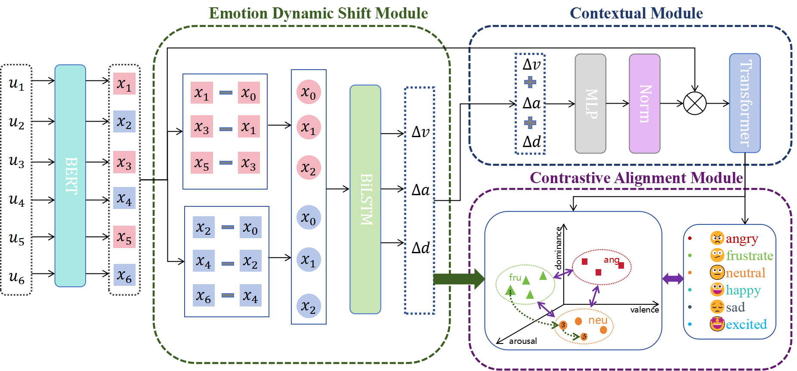

# UniEMO

Unified dialog emotion recognition (ERC) model. It jointly models utterance semantics, contextual dynamics, and VAD/ΔVAD (valence–arousal–dominance and their changes) with optional contrastive losses.

## Requirements
- Install all dependencies: `pip install -r requirements.txt`

## Data Prep (IEMOCAP/NNIME)
1) Build CSV/TSV from raw transcripts and emotion annotations:
   - `python dataprepare/iemocap_prepaer.py` 
   - Output: `datasets/iemocap/csv/`
2) Convert CSV to final training TSV:
   - `python dataprepare/dataprepare_iemocap.py`
   - Output: `datasets/iemocap/`
3) Generate auxiliaries if using ΔVAD/consistency:
   - `python dataprepare/loss_mask_prepare.py`
   - `python dataprepare/subtask_indexprepare.py`
   - `python dataprepare/vad_diff.py`

Expected files per split (`train/valid/test`):
- `iemocap_[split]_utterances.tsv`, `iemocap_[split]_emotion.tsv`, `iemocap_[split]_classify.tsv`
- `iemocap_[split]_speakers.tsv`, `iemocap_[split]_subtask01_index.tsv`, `iemocap_[split]_loss_mask.tsv`
- `iemocap_[split]_valence.tsv`, `arousal.tsv`, `dominance.tsv`
- `iemocap_[split]_v_diff.tsv`, `a_diff.tsv`, `d_diff.tsv`

## Quick Start · Eval (use trained weights)

- Run the evaluation script (eval.py) to load a trained checkpoint and print weighted F1 and the confusion matrix on the test split:
   - `python ../ESD-ERC/eval3.py --checkpoint /path/to/<your_id>_best_model.pth --dataset iemocap --model bert --mode 0 --batch_size 1`

## Train
Example:
- `python train.py --dataset iemocap --model bert --mode 1 --epochs 30 --batch_size 1 --save_model --contrastive supcon`

## Outputs
- Logs and reports under `logs/`, `results/`
- Curves and figures under `images/`
- Best model weights under `save_models/` (`.pth`)
- Intermediate arrays (`.npy`) saved during train/eval (see code)

## Notes
### Data Access
- IEMOCAP (requires registration): https://sail.usc.edu/iemocap/iemocap_release.htm
- NNIME (requires registration): https://nnime.ee.nthu.edu.tw/down/

Please follow the dataset providers' application procedures and terms of use before downloading. After obtaining the datasets, prepare files as described in the "Data Prep" section.

### Citation
If you use this code for research, please cite the repository and any original datasets according to their license terms.